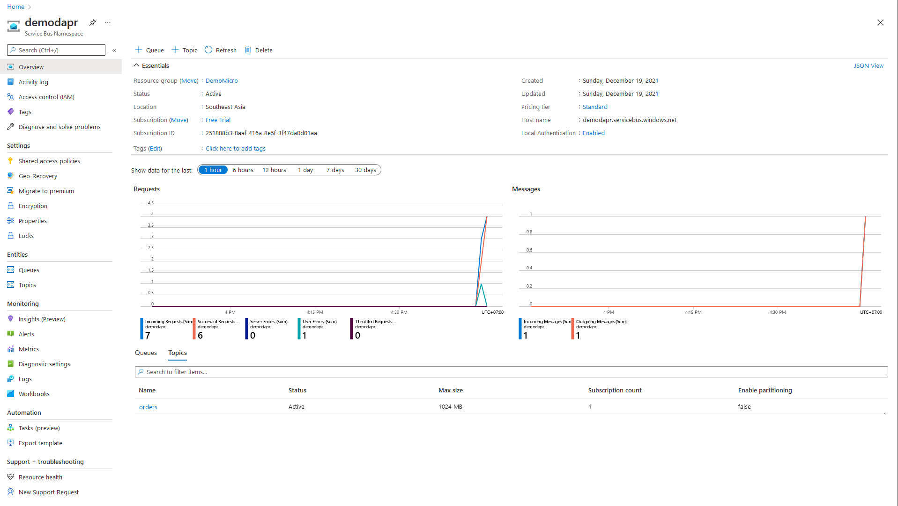
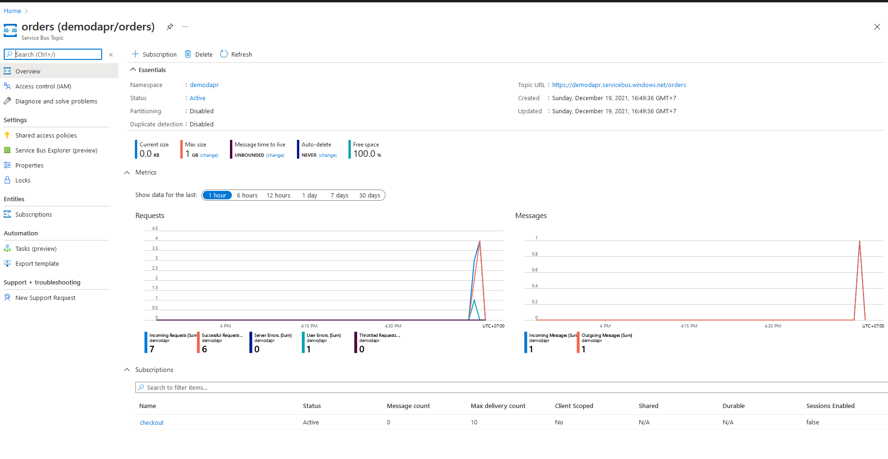

# NET5 Microservices Using DAPR And AzureServiceBus
Example: Microservices using DAPR

    + Publish and Subscribe messages via AzureServiceBus
    + Run on Kubernetes

### Requirements
----------------
+ Install [Dapr](https://docs.dapr.io/getting-started/)
+ Install [Dapr CLI](https://docs.dapr.io/getting-started/install-dapr-cli/)
+ Install [kubectl](https://kubernetes.io/docs/tasks/tools/)
+ Minikube or Kubernetes cluster (see below if needed)
+ Install .NET5
+ Follow [Publish a message and subscribe to a topic](https://docs.dapr.io/developing-applications/building-blocks/pubsub/howto-publish-subscribe/)
+ Create a account in Azure
    - Just a note, to use Azure Service Bus Topics, the "standard" pricing tier is required.


### Structures
----------------
+ Producer: using the API sends messages
+ ConsumerAPI: receive messages from Queue(consumer-consumers-order) and Topic(messages.commands~order)
+ Messages: create message model and Service Connection Config for RabbitMQ and Azure Service Bus
+ Components: `pubsub.yaml` is config your message bus(AzureServiceBus)

### Minikube
+ Enable the Ingress Controller
    ```
    minikube addons enable ingress
    ```

+ Verify the NGINX Ingress Controller
    ```
    kubectl get pods -n ingress-nginx
    ```

+ Expose Producer Service
    ```
    minikube service --url producer
    ```

    |-----------|----------|-------------|------------------------|
    | NAMESPACE |   NAME   | TARGET PORT |          URL           |
    |-----------|----------|-------------|------------------------|
    | default   | producer |             | http://127.0.0.1:56210 |
    |-----------|----------|-------------|------------------------|
    http://127.0.0.1:56210

+ Send a message from Producer to Consumer
    ```
    http://127.0.0.1:56210/order
    {
        "OrderAmount":12.7,
        "OrderNumber":"Num18291",
        "OrderDate":"2021-12-21"
    }
    ```

+ Publish message
    

+ Consumer message
    

+ Overview Azure
    

+ Topic
    


### References
--------------
+ [Dapr Pub Sub ASP Net Core integration](https://yourazurecoach.com/2019/12/27/exploring-dapr-pub-sub-part-2-asp-net-core-integration/)
+ [Dapr with Azure Service Bus](https://yourazurecoach.com/2019/12/27/exploring-dapr-pub-sub-part-3-azure-service-bus/)
+ [Dapr publish subcriber for net developers](https://docs.microsoft.com/en-us/dotnet/architecture/dapr-for-net-developers/publish-subscribe)
+ [Running a Dapr Application on Kubernetes](https://sookocheff.com/post/dapr/running-a-dapr-application-on-kubernetes/)