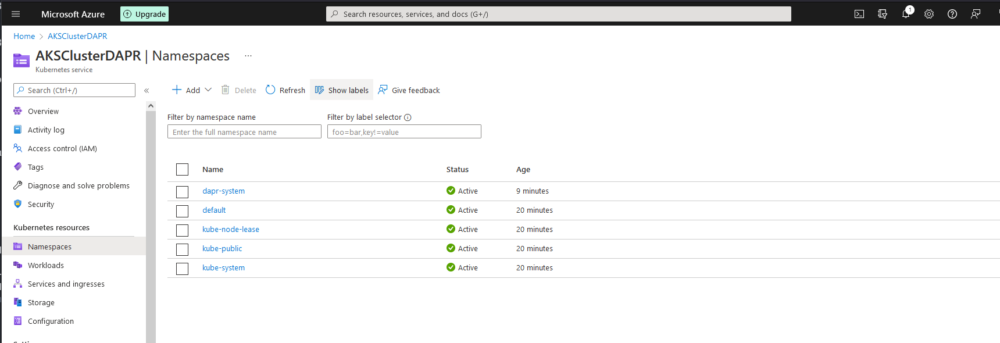
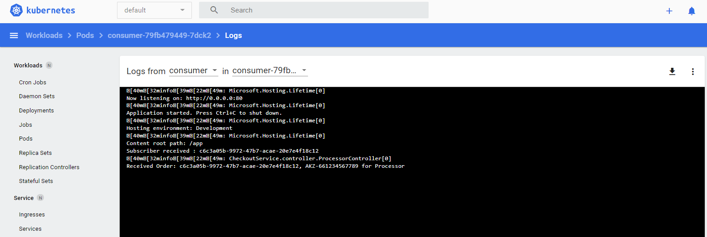
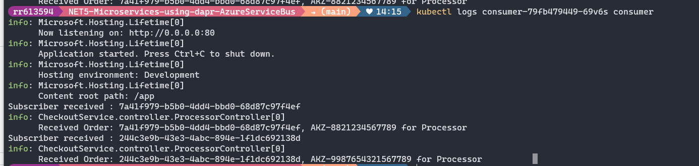
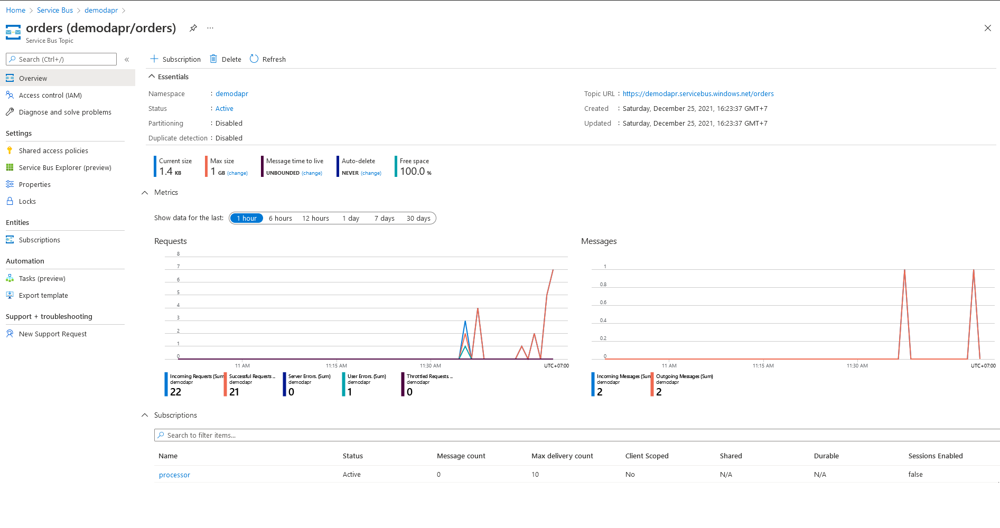

# NET5 Microservices Using DAPR And AzureServiceBus
Example: Microservices using DAPR

    + Publish and Subscribe messages via AzureServiceBus
    + Run on Kubernetes(Minikube and AKS)

### Requirements
----------------
+ Install [Dapr](https://docs.dapr.io/getting-started/)
+ Install [Dapr CLI](https://docs.dapr.io/getting-started/install-dapr-cli/)
+ Install [kubectl](https://kubernetes.io/docs/tasks/tools/)
+ Minikube or Kubernetes cluster (see below if needed)
+ Install Docker & DockerCompose
+ Follow [Publish a message and subscribe to a topic](https://docs.dapr.io/developing-applications/building-blocks/pubsub/howto-publish-subscribe/)
+ Create a account in Azure
    - Just a note, to use Azure Service Bus Topics, the "standard" pricing tier is required.


### Structures
----------------
+ Producer: using the API sends messages via AzureServiceBus
+ Consumer: receive messages from Topic: orders and Subscription: processor
+ Messages: create message model for PubSub
+ Components: `azure-pubsub.yaml` is config your message bus(AzureServiceBus)

### Dapr
---------
+ Install Dapr on Kubenetes
    ```
    dapr init -k
    ```

+ Check status
    ```
    dapr status -k
    ```

+ Verify Dapr
    ```
    $ kubectl get pod -n dapr-system
    ```

### Minikube
-------------
+ Start AzureServiceBus Component
    ```
    kubectl apply -f Components/azure-pubsub.yaml

    ```

+ Start Services
    ```
    kubectl apply -f k8s/consumer.yaml
    kubectl apply -f k8s/producer.yaml
    ```

+ Start Ingress Controller
    ```
    kubectl apply -f k8s/ingress-minikube.yaml
    ```

+ Verify your services
    ```
    kubectl get pods
    ```

+ Expose Producer Service
    ```
    minikube service --url producer
    ```
    ```
    |-----------|----------|-------------|------------------------|
    | NAMESPACE |   NAME   | TARGET PORT |          URL           |
    |-----------|----------|-------------|------------------------|
    | default   | producer |             | http://127.0.0.1:56210 |
    |-----------|----------|-------------|------------------------|
    http://127.0.0.1:56210
    ```

+ Send a message from Producer to Consumer
    ```
    http://127.0.0.1:56210/order
    {
        "OrderAmount":12.7,
        "OrderNumber":"Num18291",
        "OrderDate":"2021-12-21"
    }
    ```

### Azure Kubernetes Service(AKS)
------------------------------------
+ Install [Azure CLI](https://docs.microsoft.com/en-us/cli/azure/install-azure-cli)

+ Login Azure
    ```
    az login
    ```

+ Create resource group
    ```
    az group create --name ExampleDapr --location japaneast
    ```

+ Create AKS
    ```
    az aks create --resource-group ExampleDapr --name AKSClusterDAPR --node-count 2 --generate-ssh-keys
    ```

+ Get the Access credentials
    ```
    az aks get-credentials -n AKSClusterDAPR -g ExampleDapr
    ```

+ Install Dapr
    ```
    dapr init -k
    ```

+ Deploy Azure Service Bus
    ```
    kubectl apply -f Components\azure-pubsub.yaml
    ```

+ Deploy Producer and Consumer
    ```
    kubectl apply -f k8s\consumer.yaml
    kubectl apply -f k8s\producer.yaml
    ```

+ [Create Static Public IP](https://stacksimplify.com/azure-aks/azure-kubernetes-service-ingress-basics/)
    ```
    az aks show --resource-group ExampleDapr --name AKSClusterDAPR --query nodeResourceGroup -o tsv
    ```
    --> MC_ExampleDapr_AKSClusterDAPR_japaneast


    ```
    az network public-ip create --resource-group MC_ExampleDapr_AKSClusterDAPR_japaneast --name AKSClusterDAPR --sku Standard --allocation-method static --query publicIp.ipAddress -o tsv
    ```
    --> 20.210.118.167


    ```
    kubectl create namespace ingress-basic
    ```

    + Add the official stable repository
    ```
    helm repo add ingress-nginx https://kubernetes.github.io/ingress-nginx
    helm repo add stable https://kubernetes-charts.storage.googleapis.com/
    helm repo update
    ```

    + Add IP
    ```
    helm install ingress-nginx ingress-nginx/ingress-nginx --namespace ingress-basic --set controller.replicaCount=2 --set controller.nodeSelector."beta\.kubernetes\.io/os"=linux --set defaultBackend.nodeSelector."beta\.kubernetes\.io/os"=linux --set controller.service.externalTrafficPolicy=Local --set controller.service.loadBalancerIP="20.210.118.167"
    ```

+ Get list services
    ```
    kubectl get service -l app.kubernetes.io/name=ingress-nginx --namespace ingress-basic
    ```

+ Get External IP
    ```
    kubectl get all -n ingress-basic
    ```

+ Access Public IP: http://20.210.118.167
    ```
    Output should be: 404 Not Found from Nginx
    ```

+ Create Ingress Service on AKS
    ```
    kubectl apply -f .\k8s\ingress-aks.yaml
    ```

+ Verify Ingress Controller Logs
    ```
    kubectl get pods -n ingress-basic
    kubectl logs -f <pod-name> -n ingress-basic
    ```

+ Check Producer API:
    ```
    GET: http://20.210.118.167/producer/order
    ```
    Make sure that it returns a status 200

+ Publish a message
    ```
    POST: http://20.210.118.167/producer/order

    {
        "OrderAmount":13.7,
        "OrderNumber":"AKZ-1234567789",
        "OrderDate":"2021-12-26"
    }
    ```

+ View logs of Producer
    ```
    kubectl logs -f <pod-name> producer
    kubectl logs -f <pod-name> daprd
    ```

+ View logs of Consumer
    ```
    kubectl logs -f <pod-name> consumer
    kubectl logs -f <pod-name> daprd
    ```

+ Uninstall Dapr on Kubernetes with CLI
    ```
    dapr uninstall --kubernetes
    ```

+ Delete resource group
    ```
    az group delete --name ExampleDapr
    ```

### Overview
-------------
+ OverView AKS
    

+ Consumer message
    

+ Consumer Logs
    

+ Overview Azure
    

+ Topic
    

### References
--------------
+ [Dapr Pub Sub ASP Net Core integration](https://yourazurecoach.com/2019/12/27/exploring-dapr-pub-sub-part-2-asp-net-core-integration/)
+ [Dapr publish subscriber for net developers](https://docs.microsoft.com/en-us/dotnet/architecture/dapr-for-net-developers/publish-subscribe)
+ [Running a Dapr Application on Kubernetes](https://sookocheff.com/post/dapr/running-a-dapr-application-on-kubernetes/)
+ [Ingress Controller in AKS](https://docs.microsoft.com/en-us/azure/aks/ingress-basic)